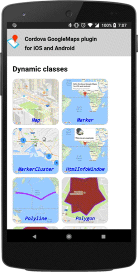

# cordova-google-maps v2.0 example

This is an example of the multiple_maps branch.

### Buy me a beer

[](https://www.paypal.com/cgi-bin/webscr?cmd=_donations&business=SQPLZJ672HJ9N&lc=US&item_name=cordova%2dgooglemaps%2dplugin&currency_code=USD&bn=PP%2dDonationsBF%3abtn_donate_SM%2egif%3aNonHosted)


# Demo apk

You can try all features of this plugin.

[Click to download the demo apk (Android)](https://github.com/mapsplugin/v2.0-demo/blob/master/cordova-googlemaps-v2-demo_11.apk?raw=true)

## How to install the apk file.

After download the apk file from the above link, install it to your android.

```bash
$> adb uninstall cordova.google.maps  // if you installed this app before.

$> adb install cordova-googlemaps-v2-demo_11.apk
```



----

## How to build the demo app

In order to use this demo, please follow the below commands:

```
$> git clone https://github.com/mapsplugin/v2.0-demo

$> cd v2.0-demo

```

Open the config.xml file, then replace [(REPLACE_WITH_YOUR_KEY)](https://github.com/mapsplugin/v2.0-demo/blob/master/config.xml#L37-L38) with your API keys.

After that, you can restore the project files.

```
$> cordova prepare

// Corfirm

$> cordova platform list
Installed platforms:
  android 5.2.2
  ios 4.2.1

$> cordova plugin list
com.googlemaps.ios 2.0.1 "Google Maps SDK for iOS"
cordova-plugin-console 1.0.4 "Console"
cordova-plugin-googlemaps 2.0.0-beta "cordova-plugin-googlemaps"
cordova-plugin-whitelist 1.2.2 "Whitelist"
cordova-plugin-wkwebview-engine 1.1.0 "Cordova WKWebView Engine"
```
----

## Update the plugin code

Since the plugin code is updated without announcement for small code,
I recommend you use the latest code of the plugin.

To update the plugin, just reinstall the plugin.

```
$> cordova plugin rm cordova-plugin-googlemaps  # remove the plugin

$> cordova prepare  # reinstall the latest plugin automatically.

```

----

## Documentations

The documents are below.

https://github.com/mapsplugin/cordova-plugin-googlemaps-doc/blob/master/v2.0.0/README.md

----
## issues

If you face any issues about v2.0-beta, please post to the [issue tracker of the demo app](https://github.com/mapsplugin/v2.0-demo/issues)
